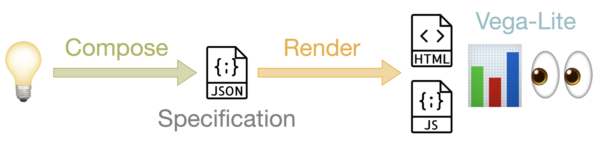

```{r setup, include=FALSE}
library("fontawesome") # rstudio/fontawesome
knitr::opts_chunk$set(echo = FALSE)
```

It's very exciting to be presenting at UseR! 2019 in Toulouse, France.

This presentation [[`r fa("file-pdf")`](vegawidget.pdf)]  incorporates contributions from the entire [vegawidget organization](https://github.com/vegawidget):

- Ian Lyttle  [`r fa("github")`](https://github.com/ijlyttle)  [`r fa("twitter")`](https://twitter.com/ijlyttle)
- Haley Jeppson [`r fa("github")`](https://github.com/haleyjeppson)  [`r fa("twitter")`](https://twitter.com/heyhayhay__)
- Alicia Schep [`r fa("github")`](https://github.com/AliciaSchep)  [`r fa("twitter")`](https://twitter.com/AliciaSchep)
- Stuart Lee [`r fa("github")`](https://github.com/sa-lee)  [`r fa("twitter")`](https://twitter.com/_StuartLee)
- Wenyu Yang [`r fa("github")`](https://github.com/wenyuyangpku)  [`r fa("twitter")`](https://twitter.com/iuysa1)
- Heike Hofmann [`r fa("github")`](https://github.com/heike)  [`r fa("twitter")`](https://twitter.com/heike_hh)

This post also serves as an announcement for the CRAN release of [vegawidget 0.2.1](https://vegawidget.github.io/vegawidget), which incorporates Vega-Lite 3.3.0. 

The vegawidget package plays a role within a larger process. Here's how we see the end-to-end process of building and deploying a Vega-Lite chart using R:


^[Code icons made by Smashicons from www.flaticon.com]

Working backwards from the end-user, we see three steps: the *Vega-Lite* library itself displays a chart in a browser, *rendered* from a JSON specification, which is *composed* by an R programmer.


- [Vega-Lite](https://vega.github.io/vega-lite/)

  - provides an interactive grammar-of-graphics
  - JavaScript library that runs in the browser

- Rendering

  - [vegawidget](https://vegawidget.github.io/vegawidget/): htmlwidget package to render Vega-Lite specifications to Vega-Lite; also to provide interactive access (including Shiny) to Vega-Lite charts. 
			
- Composing

  These packages are created by members of the [vegawidget organization](https://github.com/vegawidget):

  - [altair](https://vegawidget.github.io/altair): wraps Python package [Altair](https://altair-viz.github.io), which covers entire Vega-Lite API. 
    
  - [vlbuildr](https://vegawidget.github.io/vlbuildr): covers entire Vega-Lite API, with pipeable functions.	
  
  - [ggvega](https://vegawidget.github.io/ggvega): translator from [ggplot2](https://ggplot2.tidyverse.org) to Vega-Lite. 
    
Going forward, we expect to focus more-and-more on the packages to *compose* specifications, while the vegawidget package *renders* in the "background".    


